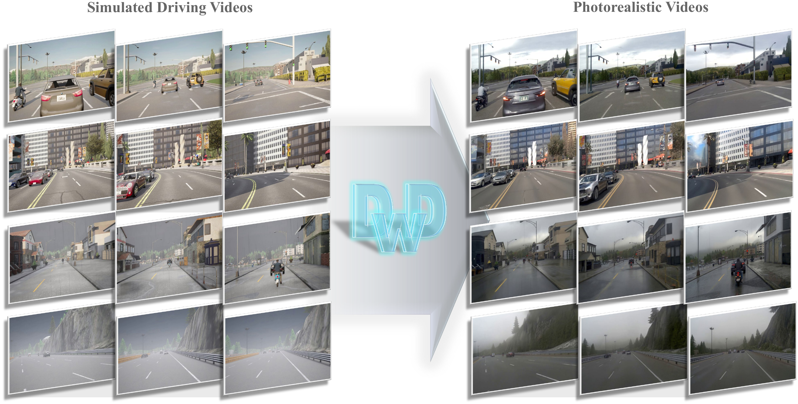
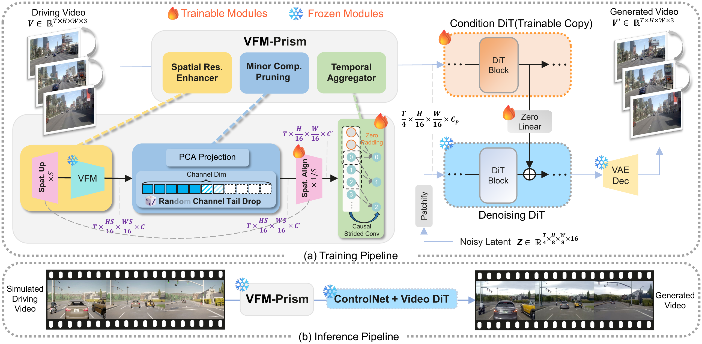

<h1 align="center">Driving with DINO: Vision Foundation Features as a Unified Bridge for Sim-to-Real Generation in Autonomous Driving</h1>

<p align="center"><strong>Accepted to ACM MM 2026</strong></p>

<p align="center">
  <a href="https://arxiv.org/abs/2602.06159"></a>
  <a href="https://albertchen98.github.io/DwD-project/"></a>
</p>

> **Note:** This code has not yet been validated through end-to-end training, as I currently do not have access to a GPU cluster. If you have any questions or encounter issues, please [open an issue](https://github.com/Albertchen98/dwd_code/issues). I'll do my best to respond promptly.

Transform simulated driving videos into realistic videos using DINOv3 features as conditioning. This repository provides training, data preprocessing, and inference code built on [NVIDIA Cosmos-Transfer2.5](https://github.com/nvidia-cosmos/cosmos-transfer2.5), with Cosmos-Predict2.5-2B as the generative backbone.



## Method Overview



## 1. Default Configuration and Repository Layout

| Setting | Default |
| --- | --- |
| Real training data | nuPlan front-view videos |
| Training video | 93 consecutive frames, 704 × 1280 |
| Feature encoder | Frozen DINOv3 ViT-L/16, final-layer features[^encoder-size] |
| DINO input resolution | 2816 × 5120, with both height and width scaled by ×4 |
| PCA | 32 components, centered using the training-set mean, without whitening |
| Random Channel Tail Drop | Randomly retain the first 3, 8, 12, 16, 20, 24, 28, or 32 channels and zero the rest |
| Temporal downsampling | Prepend 3 zero frames; temporal convolutions reduce 96 frames to 24 |
| Training mode | Offline DINO features; online extraction is optional |
| Resources and schedule | Single node with 8 GPUs, 10,000 iterations, checkpoint every 1,000 iterations |

[^encoder-size]: We expect smaller DINOv3 backbones, such as ViT-S/16 and ViT-S+/16, to be viable alternatives for this approach. Unfortunately, limited compute resources prevented us from conducting further backbone-size ablations. We also hypothesize that smaller backbones may produce feature maps with a smaller sim-to-real gap, but this remains unverified. As a related example, [Control-DINO: Feature Space Conditioning for Controllable Image-to-Video Diffusion](https://arxiv.org/html/2604.01761v1#S4.SS2) uses DINOv3 ViT-S/16. Its use of a small backbone does not establish the gap hypothesis. Exploring these alternatives requires adapting the encoder configuration and fitting the corresponding PCA basis; the current configuration targets ViT-L/16.

**The ×4 scaling applies only to the DINO encoder input; it does not change the generated video resolution.** DINOv3 uses its pretrained LayerNorm, including the learned scale and bias. Input images use ImageNet normalization. Feature L2 normalization is disabled by default.

The temporal module uses convolutions with symmetric padding and GroupNorm and is not strictly causal.

```text
dwd_code/
├── cosmos_transfer2/             # Models, datasets, optimization, and inference
├── scripts/
│   ├── prepare_nuplan_videos.py  # Epona metadata → front-view videos
│   ├── get_cr1_embeddings.py     # Text → Cosmos-Reason embeddings
│   ├── dino_pca_fit.py           # Fit PCA
│   ├── extract_dino_features.py # Cache offline DINO features
│   ├── train_dwd.py             # Training launcher and input checks
│   ├── train.py                 # Underlying training loop entry point
│   └── distcp_to_pt.py          # DCP → inference weights
├── sh_scripts/inference_hr_video.sh
├── docs/
├── pyproject.toml
├── requirements-dwd.txt
└── uv.lock
```

## 2. Environment Setup

Run the following commands from the repository root. The base environment uses Linux x86-64, Python 3.10, CUDA 12.8, and PyTorch 2.7.1. See the [environment guide](docs/setup.md) for GPU wheel and driver requirements. GPU memory requirements for ×4 training have not yet been measured.

Install [uv](https://docs.astral.sh/uv/getting-started/installation/), then run:

```bash
uv sync --frozen
source .venv/bin/activate
uv pip install -r requirements-dwd.txt

nvidia-smi
python -c 'import torch; print(torch.__version__, torch.cuda.is_available(), torch.cuda.device_count())'
python -c 'from transformers import DINOv3ViTModel, DINOv3ViTImageProcessorFast'
```

**Environment validation status:** Install both the base dependencies in `uv.lock` and the DINOv3 dependencies in `requirements-dwd.txt`. The lock file pins Transformers 4.51.3; the second installation step provides a version with DINOv3 support. Do not run `uv sync --frozen` again after installing them, as it would restore the pinned versions. A DwD dependency lock validated through full GPU training is not yet available.

## 3. Model Weights and Paths

The generative backbone is **[NVIDIA Cosmos-Predict2.5-2B — model card and weights](https://huggingface.co/nvidia/Cosmos-Predict2.5-2B)**. The exact `base/post-trained` checkpoint and download command are listed below.

### Why Cosmos-Reason1-7B Is Required

**Naming clarification:** The official Cosmos-Predict2.5 code names this encoder `nvidia/Cosmos-Reason1.1-7B` internally, while its [checkpoint registry](https://github.com/nvidia-cosmos/cosmos-predict2.5/blob/main/packages/cosmos-oss/cosmos_oss/checkpoints.py) maps it to the public Hugging Face repository `nvidia/Cosmos-Reason1-7B` at revision `3210bec0495fdc7a8d3dbb8d58da5711eab4b423`. The encoder uses a Qwen2.5-VL-7B architecture and tokenizer configuration; that architecture name does not mean it loads the original Qwen weights. DwD's configuration uses the internal encoder name `reason1p1_7B` and a local directory named `Cosmos-Reason1-7B`.

To obtain the exact public revision registered by NVIDIA:

```bash
hf download nvidia/Cosmos-Reason1-7B \
  --revision 3210bec0495fdc7a8d3dbb8d58da5711eab4b423 \
  --local-dir model_hubs/nvidia/Cosmos-Reason1-7B
```

[Cosmos-Reason1-7B](https://huggingface.co/nvidia/Cosmos-Reason1-7B) supplies the text embeddings used to condition the Cosmos video model. The models have separate roles in this workflow:

| Model | Role |
| --- | --- |
| Qwen3-VL | Describe input videos in English; captions are then trimmed to about 200 words. |
| Cosmos-Reason1-7B | Encode those captions or inference prompts into the text conditioning expected by the video model. |
| DINOv3 | Extract visual conditioning features from input videos. |
| Cosmos-Predict2.5-2B | Provide the generative backbone initialized for DwD training. |

The caption pipeline is `video → Qwen3-VL → trimmed caption → Cosmos-Reason1-7B → text embeddings`. Qwen3-VL produces the caption text; its hidden features cannot be substituted directly for the Cosmos text embeddings.

For preprocessing, `scripts/get_cr1_embeddings.py` loads Cosmos-Reason1-7B and saves the caption embeddings. Default training reads these cached embeddings with `text_encoder_config.compute_online=False`, so it does not load the 7B text encoder during training. This also applies to `--feature-mode online`, which controls DINO feature extraction only. The provided inference script sets `text_encoder_config.compute_online=True` and therefore needs the Cosmos-Reason1-7B weights to encode new prompts.

Prepare the following local files. Place `model_hubs` in the repository root to use the default inference script:

```text
model_hubs/
├── dinov3-vitl16/                  # DINOv3 ViT-L/16 in Hugging Face format
└── nvidia/
    ├── Cosmos-Predict2.5-2B/
    │   └── tokenizer.pth
    └── Cosmos-Reason1-7B/          # Text feature encoder
checkpoints/
├── base_model.pt                  # Local alias for the Predict2.5-2B post-trained BF16 EMA weights below
└── pca/
    ├── patch_pca_mean_32.npy
    └── patch_pca_components_32.npy
```

### Base Model: Exact Checkpoint

`checkpoints/base_model.pt` is a local filename used in this guide for the **Cosmos-Predict2.5-2B base/post-trained BF16 EMA checkpoint**. DwD initializes its generative backbone from this Predict2.5 checkpoint. The filename `base_model.pt` is an alias, not an official NVIDIA artifact name.

| Field | Value |
| --- | --- |
| Hugging Face repository | [nvidia/Cosmos-Predict2.5-2B](https://huggingface.co/nvidia/Cosmos-Predict2.5-2B) |
| Variant | `base/post-trained` |
| Exact weight file | [81edfebe-bd6a-4039-8c1d-737df1a790bf_ema_bf16.pt](https://huggingface.co/nvidia/Cosmos-Predict2.5-2B/blob/15a82a2ec231bc318692aa0456a36537c806e7d4/base/post-trained/81edfebe-bd6a-4039-8c1d-737df1a790bf_ema_bf16.pt) |
| Pinned repository revision | `15a82a2ec231bc318692aa0456a36537c806e7d4` |

This matches the checkpoint path in DwD's [training configuration](cosmos_transfer2/_src/transfer2/configs/vid2vid_transfer/experiment/exp_large_scale.py) and the filename and revision in [NVIDIA's checkpoint registry](https://github.com/nvidia-cosmos/cosmos-predict2.5/blob/main/packages/cosmos-oss/cosmos_oss/checkpoints_predict2.py). The required initialization checkpoint is the Predict2.5 **post-trained** variant; the separately released Transfer2.5 control checkpoints and other Predict2.5 variants are different artifacts.

Download the exact file from the repository root and create the local alias used below. If Hugging Face requests authentication or access approval, complete it on the model page and run `hf auth login` first.

```bash
hf download nvidia/Cosmos-Predict2.5-2B \
  base/post-trained/81edfebe-bd6a-4039-8c1d-737df1a790bf_ema_bf16.pt \
  --revision 15a82a2ec231bc318692aa0456a36537c806e7d4 \
  --local-dir model_hubs/nvidia/Cosmos-Predict2.5-2B

mkdir -p checkpoints
ln -s ../model_hubs/nvidia/Cosmos-Predict2.5-2B/base/post-trained/81edfebe-bd6a-4039-8c1d-737df1a790bf_ema_bf16.pt \
  checkpoints/base_model.pt
```

The symlink command leaves any existing `checkpoints/base_model.pt` untouched and fails if that path already exists. You may instead pass the original downloaded file directly to `--base-checkpoint`; no renaming or format conversion is required. This command downloads only the backbone weights. Prepare `tokenizer.pth`, DINOv3, and Cosmos-Reason1 separately as shown in the layout above.

Obtain the base model, DINOv3, and text encoder weights separately; the training launcher does not download them automatically. Project checkpoints, their corresponding PCA files, and the CarlaData30hr download link are not yet provided.

Set the following variables for the commands below, replacing the dataset path:

```bash
export DATA_ROOT=/absolute/path/to/nuplan_train
export MODEL_HUBS="$PWD/model_hubs"
export DINO_CKPT="$MODEL_HUBS/dinov3-vitl16"
export BASE_CKPT="$PWD/checkpoints/base_model.pt"
export PCA_DIR="$PWD/checkpoints/pca"
export OUTPUT_ROOT="$PWD/outputs"
```

**The PCA basis must match the checkpoint.** You may fit a new PCA basis when training your own model. When using an existing trained checkpoint, use its corresponding PCA files rather than replacing them with a newly fitted basis.

## 4. Data Preprocessing

### 4.1 Extract Front-View Videos from nuPlan

Follow the [Epona data preparation guide](https://github.com/Kevin-thu/Epona/blob/main/data_preparation/README.md) to organize the raw nuPlan data and generate sequence JSON files. Configure the data root and metadata output directory, and split training and validation data by log to prevent overlap between splits.

Convert sequence JSON files containing `CAM_F0`, `scene`, and `data_root` fields into videos:

```bash
export EPONA_META=/absolute/path/to/epona/sequence_json
export NUPLAN_SENSOR_ROOT=/absolute/path/to/nuplan/sensor_blobs
# Set the actual camera frame rate after checking metadata timestamps.
# This argument does not perform temporal resampling.
export SOURCE_FPS=12

python -m scripts.prepare_nuplan_videos \
  --metadata-dir "$EPONA_META" \
  --sensor-root "$NUPLAN_SENSOR_ROOT" \
  --output-root "$DATA_ROOT" \
  --fps "$SOURCE_FPS"
```

The value `12` above is only an example; use the frame rate determined from the timestamps of your extracted data. The converter preserves frame order, skips sequences shorter than 93 frames, and writes `videos/pinhole_front/<stem>.mp4`. It does not interpolate frames or change the sampling frequency.

### 4.2 Prepare Captions and Text Embeddings

Generate English captions with [scripts/qwen_caption.py](scripts/qwen_caption.py), using `Qwen/Qwen3-VL-32B-Instruct` by default. The script samples video frames at 1 FPS, generates a scene description, and postprocesses it to approximately 200 words before text embedding extraction.

Run caption generation in a separate environment because vLLM has its own PyTorch dependencies. The [official Qwen3-VL guide](https://github.com/QwenLM/Qwen3-VL#deployment) specifies vLLM ≥ 0.11.0, Transformers ≥ 4.57.0, and `qwen-vl-utils==0.0.14`. The following environment is separate from the DwD training environment and has not yet been validated end to end here:

```bash
uv venv --python 3.10 .venv-caption
uv pip install --python .venv-caption/bin/python \
  "vllm>=0.11.0" "transformers>=4.57.0,<5" "qwen-vl-utils[decord]==0.0.14" tqdm

.venv-caption/bin/python -m scripts.qwen_caption \
  --input "$DATA_ROOT/videos/pinhole_front" \
  --output "$DATA_ROOT/metas" \
  --model Qwen/Qwen3-VL-32B-Instruct \
  --tensor-parallel-size 4 --max-words 200 \
  --raw-output "$DATA_ROOT/captions_raw"
```

Use `--model` to specify a local Qwen3-VL checkpoint or another Qwen3-VL model size. The script writes `metas/<stem>.txt` for each video and skips existing caption files. Optional `--raw-output` preserves the untrimmed responses in a separate directory. Postprocessing collapses whitespace and caps captions at 200 whitespace-separated words, preferring a sentence boundary between 180 and 200 words. Shorter captions are retained without padding; this is trimming, not semantic summarization. Review the captions before training. The complete caption list used in the paper is not included.

Then use the DwD training environment to encode the **trimmed** captions:

```bash
source .venv/bin/activate
```

```bash
python -m scripts.get_cr1_embeddings \
  --dataset_path "$DATA_ROOT" \
  --pretrained_model_name_or_path "$MODEL_HUBS/nvidia/Cosmos-Reason1-7B" \
  --num_workers 1
```

Outputs are saved to `cosmos_reason_xxl/<stem>.safetensors` under the key `text_embedding`.

### 4.3 Fit PCA

Fit PCA using only the training split. Reuse the same PCA files for validation and inference:

```bash
python -m scripts.dino_pca_fit \
  --video-dir "$DATA_ROOT/videos/pinhole_front" \
  --dino-checkpoint "$DINO_CKPT" \
  --output-dir "$PCA_DIR" \
  --components 32 --seed 0
```

By default, the script samples up to 1,000 videos, one frame per video, and up to 4,096 patches per frame. It saves the mean, principal components, and sampling metadata. Adjust sampling with `--max-videos` and `--patches-per-video`. Refitting PCA changes the model's conditioning feature space.

### 4.4 Extract Offline DINO Features (Default)

```bash
python -m scripts.extract_dino_features \
  --video-dir "$DATA_ROOT/videos/pinhole_front" \
  --output-dir "$DATA_ROOT/dinov3_x4_pca32" \
  --dino-checkpoint "$DINO_CKPT" \
  --pca-dir "$PCA_DIR" --batch-size 1
```

Each video produces a `.pt` tensor of shape `[1,32,T,176,320]` and metadata. **Cache all frames and all 32 channels without Tail Drop or temporal downsampling.** Both operations are applied during training.

For extraction across multiple GPUs, use `--num-shards N --shard-index i` and assign a GPU to each process with `CUDA_VISIBLE_DEVICES`. The extractor refuses to overwrite existing outputs. Each video's CPU buffer requires approximately `T × 3.44 MiB`; allow sufficient RAM and disk space.

The resulting dataset layout is:

```text
nuplan_train/
├── videos/pinhole_front/<stem>.mp4
├── metas/<stem>.txt
├── cosmos_reason_xxl/<stem>.safetensors
└── dinov3_x4_pca32/<stem>.pt
```

## 5. Training

### 5.1 Check Inputs

```bash
python -m scripts.train_dwd \
  --dataset "$DATA_ROOT" --model-hubs "$MODEL_HUBS" \
  --base-checkpoint "$BASE_CKPT" --check-only
```

This checks that videos exist, each video has matching text and feature files, and the required weight paths are present. It does not load models or validate tensor contents or the GPU environment. Use `--dry-run` to print the command without checking files.

### 5.2 Train with Offline Features

```bash
python -m scripts.train_dwd \
  --dataset "$DATA_ROOT" --model-hubs "$MODEL_HUBS" \
  --base-checkpoint "$BASE_CKPT" \
  --output-dir "$OUTPUT_ROOT" --run-name dwd_x4 \
  --gpus 8 --max-iter 10000 --checkpoint-every 1000 --seed 0
```

The main configuration is in [dwd.py](cosmos_transfer2/_src/transfer2/configs/vid2vid_transfer/experiment/dwd.py). Training freezes the generative backbone and optimizes the control modules. Tail Drop randomly selects the number of retained channels for each sample and zeros the remaining channels; tensors still contain 32 channels.

### 5.3 Train with Online Features

If GPU memory permits, skip the caching step in Section 4.4. The remaining data and PCA files are still required:

```bash
python -m scripts.train_dwd \
  --dataset "$DATA_ROOT" --model-hubs "$MODEL_HUBS" \
  --base-checkpoint "$BASE_CKPT" \
  --feature-mode online --dino-checkpoint "$DINO_CKPT" --pca-dir "$PCA_DIR" \
  --output-dir "$OUTPUT_ROOT" --run-name dwd_x4_online --gpus 8
```

DINOv3 remains frozen and encodes one frame at a time by default to reduce peak GPU memory usage. Online and offline extraction use the same RGB preprocessing. The dataset already applies ImageNet normalization, so the encoder uses `use_processor=False` to avoid normalizing twice.

### 5.4 Validation, Outputs, and Resuming Training

- `--val-dataset /path/to/nuplan_val`: enable a separate validation split with the same directory structure as the training split. Validation is disabled by default.
- `--workers 4`: number of data-loading workers per process.
- `--max-iter 1`: attempt a single training iteration in your GPU environment.
- The GPU count must divide the 24 latent frames evenly. Using fewer GPUs does not guarantee sufficient GPU memory.
- `--output-dir` sets `IMAGINAIRE_OUTPUT_ROOT`. Consult the training logs for the exact experiment output and checkpoint paths.

To restore the full training state, pass a DCP iteration directory containing `model/`:

```bash
python -m scripts.train_dwd \
  --dataset "$DATA_ROOT" --model-hubs "$MODEL_HUBS" \
  --resume /absolute/path/to/run/checkpoints/iter_000005000 \
  --output-dir "$OUTPUT_ROOT" --run-name dwd_x4 --gpus 8
```

When resuming online training, also pass the original `--feature-mode online`, DINO checkpoint, and PCA paths. Keep the model, data splits, and PCA basis consistent. `--max-iter` specifies the total target iteration count.

## 6. Export and Inference

### 6.1 Export Inference Weights

```bash
python -m scripts.distcp_to_pt --convert_checkpoint \
  --save_path /absolute/path/to/run/checkpoints/iter_000010000
```

The converter reads `model/` inside the iteration directory and exports `model_ema_reg.pt`, `model_ema_fp32.pt`, and the BF16 EMA weights `model.pt` used for inference. Save the training configuration and PCA files alongside the weights.

### 6.2 Prepare Features for Simulated Videos

Extract features from CARLA videos using **the same PCA basis and DINO checkpoint used for training**:

```bash
python -m scripts.extract_dino_features \
  --video-dir /absolute/path/to/carla/videos \
  --output-dir /absolute/path/to/carla/features \
  --dino-checkpoint "$DINO_CKPT" --pca-dir "$PCA_DIR" --batch-size 1
```

Prepare a text prompt with a matching filename stem for each simulated video. The official CarlaData30hr download link, splits, and manifests are pending; these commands can be used with your own videos.

### 6.3 Single-Video Inference

```bash
bash sh_scripts/inference_hr_video.sh \
  /absolute/path/to/model.pt \
  /absolute/path/to/video.mp4 \
  /absolute/path/to/features.pt \
  /absolute/path/to/prompt.txt \
  ./outputs/inference
```

By default, the script loads the tokenizer and Cosmos-Reason weights from `model_hubs/` in the repository root and uses 8 GPUs, 32 PCA channels, and the first 93 frames. Channels are not randomly dropped during inference. Set `PCA_CHANNELS=8` to condition on the first 8 components of the same PCA basis; the network pads the remaining channels with zeros.

### 6.4 Folder Inference

```bash
INPUT_MODE=folder NUM_GPUS=8 PCA_CHANNELS=8 \
  bash sh_scripts/inference_hr_video.sh \
  /absolute/path/to/model.pt \
  /absolute/path/to/carla/videos \
  /absolute/path/to/carla/features \
  /absolute/path/to/carla/prompts \
  ./outputs/carla
```

Filename stems must match across the three input directories. Folder mode processes videos sequentially using the same GPU group; it does not launch an independent worker on each GPU. Set sampling parameters with `SEED`, `GUIDANCE`, `NUM_STEPS`, and `CONTROL_WEIGHT`. Add `DRY_RUN=1` to print the command without running inference.

## 7. Validation and Release Status

The training entry point and key tensor operations have undergone static and CPU checks. End-to-end training and inference with real data, official checkpoints, and multiple GPUs have not yet been validated. A fully reproducible release still requires a validated environment lock, base and project weights with checksums, the paper's data splits and caption manifests, and CarlaData30hr download information. This implementation does not yet claim reproduction of the paper's metrics.

This code is based on NVIDIA Cosmos and retains upstream copyright notices. See [ATTRIBUTIONS.md](ATTRIBUTIONS.md) and [LICENSE](LICENSE) for third-party attribution and licensing.
